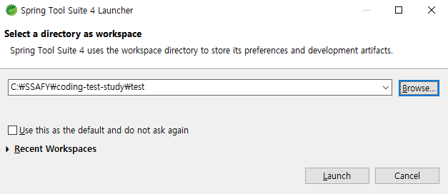
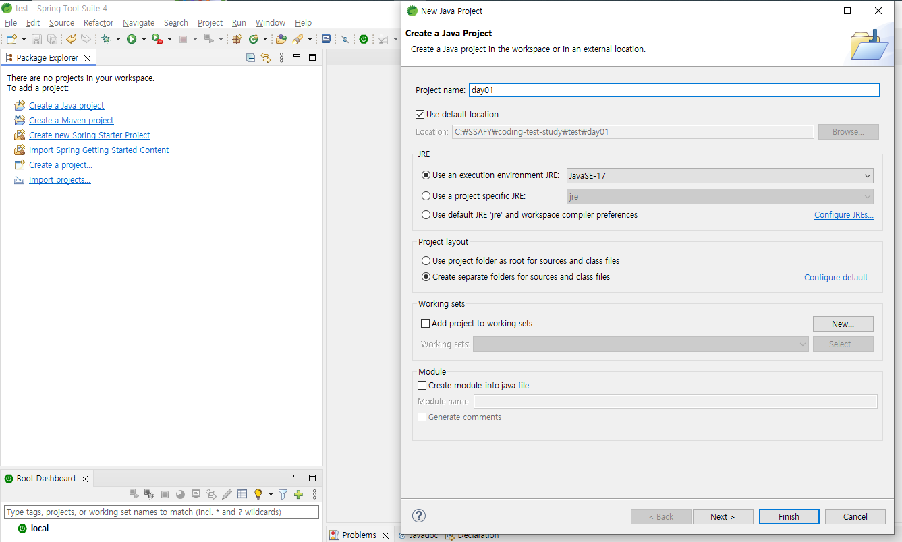
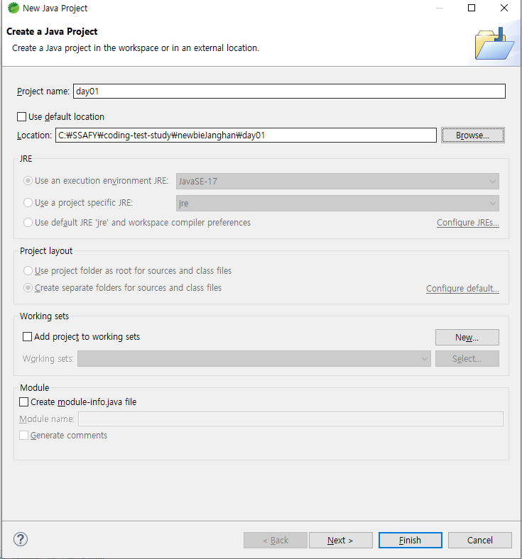

# How to start
## 프로젝트 세팅
```bash
# 레포지토리 클론
git clone https://github.com/grab-your-java/coding-test-study.git

# 개인 폴더 생성
# 생성된 폴더는 github repository 메인 화면에 바로 보입니다!
cd coding-test-study
mkdir "개인 폴더 이름" 
```

## Eclipse (STS) 시작하기
### 1. STS 열기



1. **Browse** 클릭  
2. coding-test-study/개인 폴더 이름    

### 2-1. Create Java Project


1. project name 입력
2. **Create module-info.java file** 체크 해제
3. Finish

### 2-2. Import Java Project


1. Use default location 체크 해제
2. Browse 로 기존 Eclipse Project directory 경로 선택
3. Finish

# Rules
## How to solve
1. 풀고자 하는 문제의 **이슈**를 확인합니다.
2. **main** branch로 이동한 후 새로운 **branch**를 생성합니다.
```bash
git checkout main
git checkout -b "새 branch"
```
3. 요구 사항을 확인한 후 개인 디렉토리에서 풀이를 작성 후 **커밋**합니다.
4. 진행한 브랜치를 remote repository (origin) 으로 **push**합니다.
```bash
git push origin "새 branch" // main X
```
4. 다른 스터디원과 공유할 수 있도록 **PR**을 작성합니다.

## Commit Rules
> [#이슈_넘버] 문제_유형 / 성공_여부: 풀이_요약  
> [#1] 스택 /  Fail: Array 활용, 시간 초과
### [#이슈_넘버]
- 해당 항목은 Github UI 상에서 커밋 로그 상에 이슈로의 하이퍼링크 기능을 합니다.  
- 풀고자 하는 문항 별 이슈가 등록되어 있습니다. 이슈 번호를 확인하여 커밋을 작성합니다.  

### 문제_유형
- 알고리즘 문항은 여러 유형으로 분류될 수 있습니다.  
- 우리 또는 본인이 연습하고자 했던 유형/주제 를 작성해주세요.   
 
### 성공_여부
- Pass OR Fail 로 기재합니다.
    > 💡 왜 Fail도 올리나요?   
    >
    >   🌱 자신은 내가 실패한 방식에 대한 피드백을 받을 수 있습니다.  
    >   💯 스터디원은 오류를 발견하고, 다른 풀이법이 안 되는 이유를 탐색하는 과정을 통해 성장합니다. 

### 풀이_요약
- 한 줄로 본인이 활용한 풀이법과 성공/실패 이유를 기재합니다.

## Branch & Pull Request Rules
1. 문제 풀이를 작성하는 브랜치 명은 스터디원과 구별되게 작성합니다.
```bash
git checkout -b "janghan/stack"
```
2. 반드시 개인 브랜치 -> main 브랜치로 PR을 시작합니다.
3. PR template을 참고하여, 스터디원과 공유하고 싶은 내용을 작성합니다.